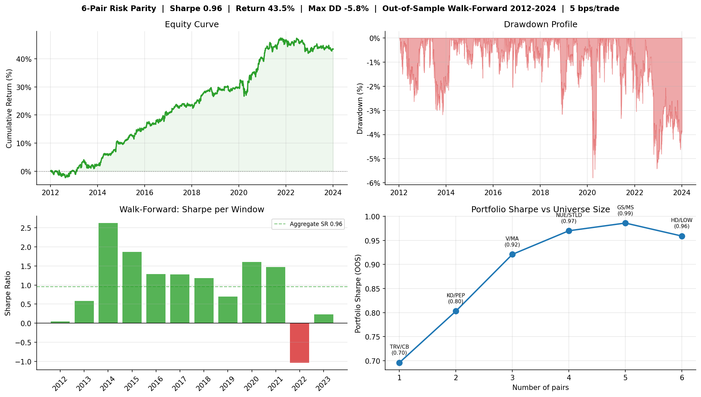

# Pairs Trading Strategy

Cointegration-based statistical arbitrage across economically linked equity pairs, validated with walk-forward testing over 12 years of market data.

**Result:** Sharpe 0.96, total return 43.5%, max drawdown -5.8% (6-pair risk parity portfolio, walk-forward validation 2012-2024)

The full research process is documented in [journal.md](journal.md). It covers the complete sequence of experiments, including failed approaches and the reasoning that led to the final strategy.

**Important:** Currently, I am conducting research on training LLM-based agents to review the false positives, and using them in addition to Benjamini-Hotchberg and other tools. This was from the original bottom-up strategy from the first few notebooks. I've managed to reduce the original pre-Benjamini false positive rate by over 75% so far, but I'm still refining the agents. Will update this repo when it's complete.

---

## Strategy Overview

The strategy identifies pairs of stocks with a structural economic link (same industry, same cost inputs, same customer base) and trades the spread between them. When the spread widens beyond a statistical threshold, the strategy buys the cheaper leg and shorts the more expensive one, then exits when the gap closes.

Pairs selected purely by statistical significance tend to fail out-of-sample. Every pair here was chosen because there is a genuine economic reason the two companies should trade together. Cointegration is a confirmation, not a justification.

---

## Key Results

| Portfolio | Sharpe | Total Return | Max Drawdown |
|-----------|--------|-------------|-------------|
| Single best pair (KO/PEP) | 0.50 | 54.3% | -16.0% |
| 5-pair equal weight | 0.75 | 39.9% | -9.6% |
| 5-pair risk parity | 0.77 | 41.0% | -8.7% |
| **6-pair risk parity (final)** | **0.96** | **43.5%** | **-5.8%** |

All results use walk-forward validation: parameters fitted on 2-year training windows, evaluated on separate 1-year test windows, no lookahead. Transaction costs of 5 bps per trade are included in every backtest.



---

## The Six Pairs

| Pair | Industry | Economic Link |
|------|----------|--------------|
| KO / PEP | Beverages | Same consumer, same input costs, same distribution |
| NUE / STLD | Steel | Only two major US mini-mill producers; identical scrap inputs and output prices |
| V / MA | Payments | Same business model, same transaction volume drivers, no credit risk |
| GS / MS | Investment Banking | Same trading and advisory revenue cycle |
| HD / LOW | Home Improvement | Same customer, same housing cycle |
| TRV / CB | Insurance | Same underwriting and catastrophe pricing cycles |

---

## Technical Features

**Pair selection**
- Engle-Granger cointegration testing on economically curated candidate universes
- Benjamini-Hochberg multiple testing correction (FDR <= 5%) to prevent false discoveries
- OU half-life filter (5-126 trading days) and cross-pair correlation filter

**Spread modeling**
- OLS hedge ratio estimated on rolling 2-year training windows and held fixed during each test period
- Ornstein-Uhlenbeck process fitting for half-life and mean-reversion speed
- Rolling z-score with no lookahead into the test window

**Portfolio construction**
- Risk parity weighting: each pair sized by inverse training-period PnL volatility
- Zero free parameters; weights derived entirely from training data

**Validation**
- Walk-forward validation: 2-year training windows, 1-year test windows, 12 windows total
- GFC stress test on pre-2010 data for five pairs with sufficient history

**Live signal system**
- `run_signals.py` generates signals for all six pairs on each run
- Writes `signals_output.json` (current signals) and appends to `signals_history.jsonl` (audit log)
- Cointegration health checks flagged on every run (`WARN_PVALUE`, `WARN_HEDGE_RATIO`)


## Setup

```bash
pip install pandas numpy yfinance statsmodels matplotlib seaborn pyarrow
```

Run notebooks 01 through 19 in order. Each builds on the previous. Data is cached locally after the first fetch.

To generate live signals:

```bash
python run_signals.py
```

Schedule with cron for daily runs:

```
0 7 * * 1-5 cd /path/to/project && python3 run_signals.py >> logs/signals.log 2>&1
```
